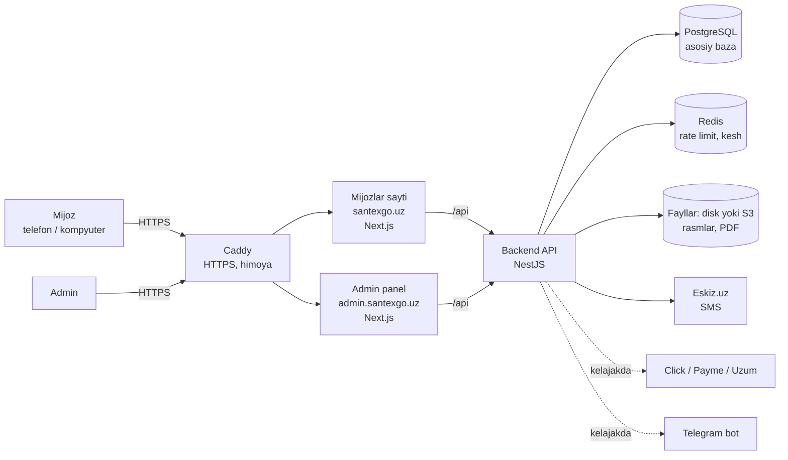
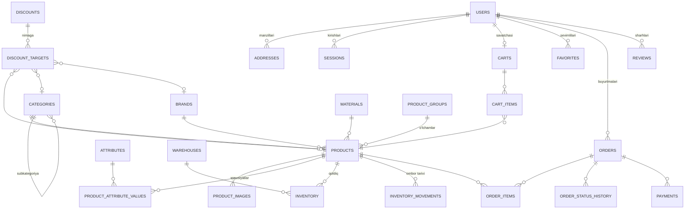
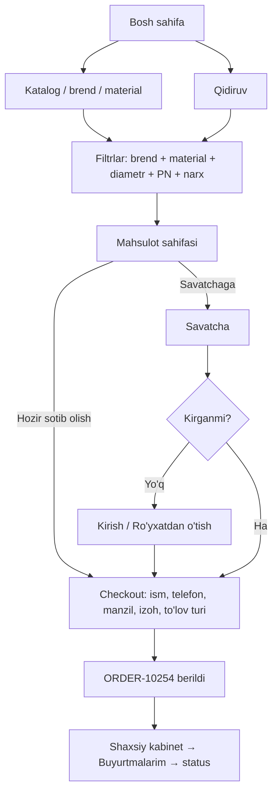
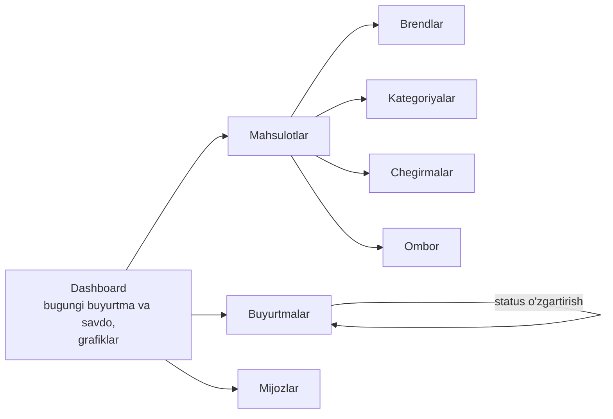
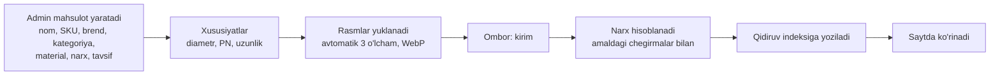
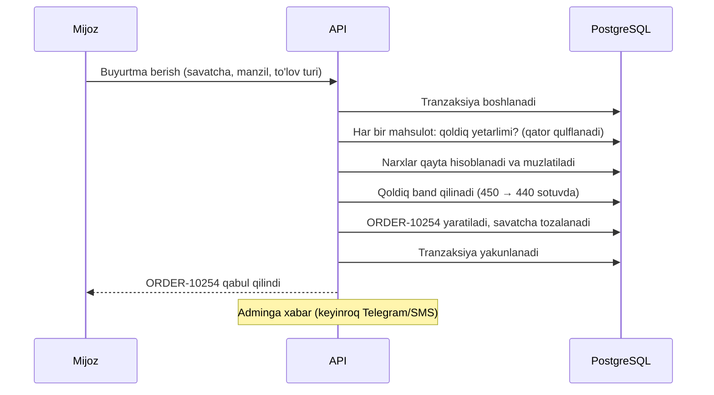
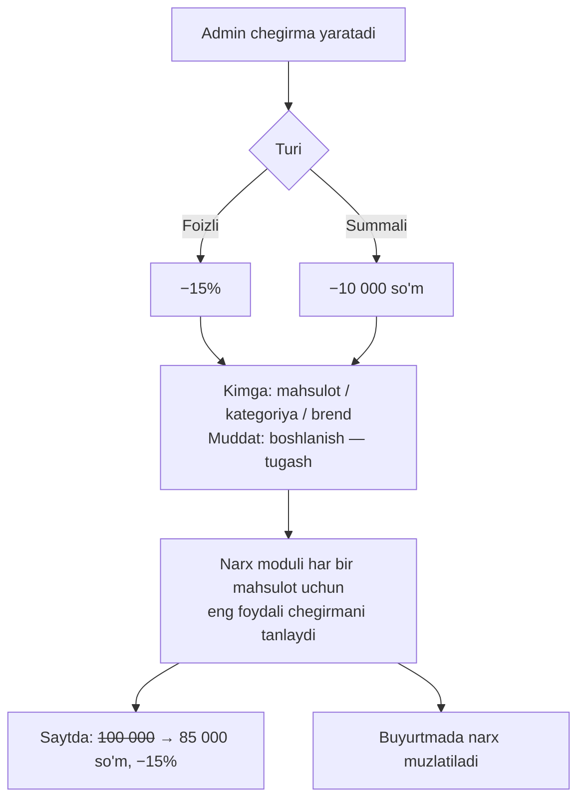

# SantexGo — arxitektura va ishlash tamoyillari

Bu hujjat platforma qanday tuzilganini va har bir jarayon qanday ishlashini tushuntiradi. Texnik bo'lmagan o'quvchi uchun ham tushunarli bo'lishga harakat qilingan; dasturchilar uchun aniq nomlar (jadval, modul, papka) qavs ichida berilgan.

Mundarija:

1. [Umumiy arxitektura](#1-umumiy-arxitektura)
2. [Ma'lumotlar bazasi tuzilmasi](#2-malumotlar-bazasi-tuzilmasi)
3. [Mijoz yo'li (user flow)](#3-mijoz-yoli-user-flow)
4. [Admin yo'li (admin flow)](#4-admin-yoli-admin-flow)
5. [Mahsulot yo'li (product flow)](#5-mahsulot-yoli-product-flow)
6. [Buyurtma yo'li (order flow)](#6-buyurtma-yoli-order-flow)
7. [Chegirma yo'li (discount flow)](#7-chegirma-yoli-discount-flow)
8. [Brend, kategoriya va material tuzilmasi](#8-brend-kategoriya-va-material-tuzilmasi)
9. [Texnologiyalar](#9-texnologiyalar)
10. [Papkalar tuzilmasi](#10-papkalar-tuzilmasi)
11. [Xavfsizlik](#11-xavfsizlik)
12. [Kelajakda kengaytirish](#12-kelajakda-kengaytirish)

---

## 1. Umumiy arxitektura

Platforma uchta mustaqil ilovadan va ularga xizmat qiluvchi bazalardan iborat:



| Qism                       | Vazifasi                                                                                                                                  |
| -------------------------- | ----------------------------------------------------------------------------------------------------------------------------------------- |
| **Mijozlar sayti** (`web`) | Katalog, qidiruv, savatcha, buyurtma, shaxsiy kabinet. Sahifalar serverda tayyorlanadi — tez ochiladi va Google'da yaxshi topiladi (SEO). |
| **Admin panel** (`admin`)  | Mahsulot, brend, kategoriya, chegirma, buyurtma, mijoz, ombor va statistika boshqaruvi. Alohida domenda.                                  |
| **Backend API** (`api`)    | Butun biznes mantiq shu yerda: narx hisoblash, ombor, buyurtma, huquqlar. Saytlar faqat API orqali ishlaydi.                              |
| **PostgreSQL**             | Asosiy va yagona "haqiqat manbai": barcha ma'lumotlar shu yerda. Qidiruv va filtrlar ham shu yerda (pg_trgm) — narx va qoldiq doim aniq.  |
| **Redis**                  | So'rovlar chegarasi (rate limit), vaqtinchalik kesh.                                                                                      |
| **Fayllar**                | Mahsulot rasmlari, brend logotiplari, sertifikatlar (PDF): server diskida yoki S3 (Cloudflare R2) da.                                     |

**Nega bunday tuzilma:**

- **Frontend va backend to'liq ajratilgan.** Sayt dizaynini o'zgartirish biznes mantiqqa tegmaydi. Kelajakda mobil ilova yoki Telegram bot ham aynan shu API'dan foydalanadi.
- **API — "modulli monolit".** Bitta dastur, lekin ichida aniq ajratilgan modullar (auth, katalog, narx, ombor, buyurtma...). Bu kichik va o'rta biznes uchun eng ishonchli variant: bitta server, oson deploy, buyurtma va ombor bitta tranzaksiyada (pul va qoldiq hech qachon "yarim yo'lda" qolmaydi). Yuklama oshsa, alohida modullarni mustaqil xizmatga ajratish mumkin.
- **Hamma narsa Docker'da.** Kompyuterda ham, serverda ham bir xil ishlaydi.

API manzillari `/api/v1/...` ko'rinishida — versiyalangan. Kelajakda API o'zgarsa, eski mobil ilovalar `v1` da ishlashda davom etadi.

---

## 2. Ma'lumotlar bazasi tuzilmasi

To'liq sxema: [`apps/api/prisma/schema.prisma`](../apps/api/prisma/schema.prisma). Asosiy jadvallar va bog'lanishlar:



| Guruh                | Jadvallar                                                                                                         |
| -------------------- | ----------------------------------------------------------------------------------------------------------------- |
| Foydalanuvchilar     | `users` (rol: CUSTOMER/ADMIN), `addresses`, `sessions` (login sessiyalari), `verification_codes` (SMS kodlar)     |
| Katalog              | `brands`, `categories` (daraxt), `materials`, `product_groups`, `products`, `product_images`, `product_documents` |
| Texnik xususiyatlar  | `attributes` (diametr, PN, uzunlik...), `category_attributes`, `product_attribute_values`                         |
| Chegirmalar          | `discounts`, `discount_targets`                                                                                   |
| Ombor                | `warehouses`, `inventory`, `inventory_movements`                                                                  |
| Savatcha, sevimlilar | `carts`, `cart_items`, `favorites`                                                                                |
| Buyurtmalar          | `orders`, `order_items`, `order_status_history`, `payments`                                                       |
| Sharhlar             | `reviews`                                                                                                         |
| Sayt va tizim        | `banners`, `home_collections`, `settings`, `audit_logs`                                                           |

**Asosiy qoidalar:**

- **Pul — butun so'mda.** Kasr sonlar yo'q, yaxlitlash xatolari bo'lmaydi.
- **Har bir o'lcham — alohida mahsulot (SKU).** "Plastherm PPR truba PN20" modelining Ø20, Ø25, Ø32 o'lchamlari — uchta alohida mahsulot, har biri o'z narxi, qoldig'i va SKU'si bilan. Ular `product_groups` orqali bog'langan, shuning uchun mahsulot sahifasida "Boshqa o'lchamlar: Ø20 Ø25 Ø32" tugmalari chiqadi.
- **Texnik xususiyatlar moslashuvchan.** Yangi xususiyat (masalan, "Rezba turi") kod yozmasdan admin paneldan qo'shiladi va avtomatik filtrga aylanadi.
- **Buyurtmada narx "muzlatiladi".** Mahsulot nomi, narxi, chegirmasi buyurtma paytidagidek saqlanadi. Ertaga narx o'zgarsa ham, eski buyurtma summasi o'zgarmaydi.
- **Ombor tarixi.** Qoldiqning har bir o'zgarishi (`inventory_movements`) — kim, qachon, qaysi buyurtma uchun — yozib boriladi. Bir nechta ombor qo'llab-quvvatlanadi.
- **Baza o'zi ham himoya qiladi.** Manfiy qoldiq, 100% dan katta chegirma, summasi mos kelmaydigan buyurtma kabi xatolarni baza qabul qilmaydi (CHECK cheklovlar) — kodda xato bo'lsa ham.
- **Buyurtma raqami** — `ORDER-10001` dan boshlab ketma-ket.

---

## 3. Mijoz yo'li (user flow)



**Ro'yxatdan o'tish:**

1. Mijoz ism, familiya, telefon, parol va parolni tasdiqlashni kiritadi → **"Kod yuborish"**.
2. Telefonga 6 xonali SMS kod keladi (5 daqiqa amal qiladi; qayta yuborish — 60 soniyadan keyin).
3. Kodni kiritadi → akkaunt yaratiladi va mijoz avtomatik tizimga kiradi.

**Kirish:** telefon + parol. **Parolni unutdim:** telefon → SMS kod → yangi parol → avtomatik kirish (boshqa qurilmalardagi barcha sessiyalar yopiladi).

**Savatcha:** mehmon (kirmagan) mijoz ham savatchaga qo'sha oladi — savatcha brauzerda saqlanadi va kirgandan keyin akkauntdagi savatcha bilan birlashtiriladi. Buyurtma berish uchun kirish talab qilinadi (buyurtma tarixi va status kuzatish uchun).

**Shaxsiy kabinet:** profil (ism, familiya, telefon), manzillar, hozirgi buyurtmalar, buyurtmalar tarixi, jami xarid summasi, sevimlilar, parolni o'zgartirish.

---

## 4. Admin yo'li (admin flow)

Admin `admin.santexgo.uz` ga telefon va parol bilan kiradi. Faqat `ADMIN` rolidagi foydalanuvchi kira oladi; har bir admin amali `audit_logs` jurnaliga yoziladi.



| Bo'lim        | Imkoniyatlar                                                                                                                 |
| ------------- | ---------------------------------------------------------------------------------------------------------------------------- |
| Dashboard     | Bugungi buyurtmalar va savdo, oylik savdo, jami mijoz va mahsulot, top mahsulot/mijoz/brend, kam qolgan qoldiq — grafiklarda |
| Mahsulotlar   | Qo'shish, tahrirlash, o'chirish (arxivlash), narx, rasmlar, SKU, xususiyatlar, qoldiq, chegirma                              |
| Brendlar      | Qo'shish, tahrirlash, o'chirish, logo yuklash, "mashhur" belgisi                                                             |
| Kategoriyalar | Kategoriya va subkategoriya, tartib, rasm, qaysi xususiyatlar ishlatilishi                                                   |
| Chegirmalar   | Foizli yoki summali, boshlanish/tugash sanasi, mahsulot/kategoriya/brendga                                                   |
| Buyurtmalar   | Barcha buyurtmalar, filtr (status, sana, mijoz), ichidagi mahsulotlar, status o'zgartirish, bekor qilish                     |
| Mijozlar      | Barcha mijozlar: buyurtmalar soni, jami xarid, oxirgi buyurtma; mijoz kartasi                                                |
| Ombor         | Qoldiqlar, kirim qilish, inventarizatsiya, kam qolganlar ro'yxati, harakatlar tarixi                                         |
| Sayt          | Bannerlar, "Material bo'yicha" tugmalari, yetkazib berish narxi, do'kon ma'lumotlari                                         |

---

## 5. Mahsulot yo'li (product flow)



- Rasmlar yuklanganda server ularni avtomatik siqadi va 3 o'lchamda (katta, o'rta, kichik) WebP formatida saqlaydi — sayt telefonda ham tez ochiladi.
- Mahsulot o'chirilmaydi, **arxivlanadi** (`isActive = false`): eski buyurtmalarda u saqlanib qoladi, saytda esa ko'rinmaydi.
- Qoldiq 0 bo'lsa, saytda **"Sotuvda yo'q"** yoziladi va savatchaga qo'shish tugmasi o'chadi.
- Mahsulot o'zgarganda (narx, qoldiq, nom) qidiruv indeksi avtomatik yangilanadi.

---

## 6. Buyurtma yo'li (order flow)



**Asosiy kafolatlar:**

- **Bir vaqtda ikki mijoz oxirgi 5 donani ololmaydi.** Qoldiq tekshirish va band qilish bitta tranzaksiyada, qator qulflangan holda bajariladi.
- **Narx serverda hisoblanadi.** Brauzerdan kelgan narxga ishonilmaydi.
- **Bir buyurtma ikki marta yaratilmaydi** — tugma ikki marta bosilsa ham (idempotency kaliti).

**Statuslar va ombor:**

| Status                    | Kim o'zgartiradi                | Ombor                                                   |
| ------------------------- | ------------------------------- | ------------------------------------------------------- |
| 1. Buyurtma qabul qilindi | Avtomatik                       | Qoldiq **band qilinadi**: sotuvda 450 → 440             |
| 2. Tasdiqlanmoqda         | Admin                           | —                                                       |
| 3. Tayyorlanmoqda         | Admin                           | —                                                       |
| 4. Yetkazib berilmoqda    | Admin                           | Mahsulot ombordan **chiqadi** (jismoniy qoldiq ham 440) |
| 5. Yetkazildi             | Admin                           | Sotilganlar soni oshadi ("Eng ko'p sotilganlar" uchun)  |
| 6. Bekor qilindi          | Admin yoki mijoz (1–2-statusda) | Band qilingan qoldiq **qaytariladi**: 440 → 450         |

Status faqat oldinga yuradi; admin oraliq bosqichni o'tkazib yuborishi mumkin (masalan, do'kondan olib ketishda "Tayyorlanmoqda" → "Yetkazildi") — o'tkazib yuborilgan bosqichning ombor amali ham bajariladi. Yo'lga chiqqan buyurtmani faqat admin bekor qiladi (mijoz qabul qilmadi) — mahsulot omborga **qaytadi**. Qaysi omborda qancha band qilingani alohida saqlanmaydi: u `inventory_movements` tarixidan (buyurtma ID bo'yicha) hisoblanadi. Har bir o'zgarish `order_status_history` ga yoziladi va mijoz kabinetida ko'rinadi.

---

## 7. Chegirma yo'li (discount flow)



- **Chegirmalar ustma-ust qo'shilmaydi.** Mahsulotga bir nechta chegirma tegishli bo'lsa (masalan, brendga −10% va kategoriyaga −15%), mijoz uchun eng foydalisi tanlanadi.
- **Kategoriyaga qo'yilgan chegirma subkategoriyalarga ham tegishli.** "Fittinglar −10%" → tirsaklar, muftalar, troyniklar ham arzonlashadi.
- **Muddat avtomatik.** Chegirma belgilangan vaqtda o'zi boshlanadi va tugaydi (server har daqiqada tekshiradi) — admin yarim tunda kirishi shart emas.
- Narx hisoblash formulasi (`packages/shared/src/discount.ts`) sayt va server uchun bitta — ekranda ko'rsatilgan narx bilan buyurtmadagi narx doim bir xil.

Misol: oddiy narx 100 000 so'm, chegirma 15% → yakuniy narx 85 000 so'm. Saytda: ~~100 000 so'm~~ **85 000 so'm** `−15%`.

---

## 8. Brend, kategoriya va material tuzilmasi

Mahsulot uchta mustaqil "o'q" bo'yicha tasniflanadi — shuning uchun istalgan kombinatsiyada filtrlash mumkin:

| O'q              | Misollar                                                                                                         | Saytda                              |
| ---------------- | ---------------------------------------------------------------------------------------------------------------- | ----------------------------------- |
| **Brend**        | Plastherm, Vero                                                                                                  | BRANDS bo'limi, `/brands/plastherm` |
| **Kategoriya**   | Trubalar; Fittinglar → Tirsaklar, Muftalar, Troyniklar; Kanalizatsiya; Armatura → Kranlar, Kranchalar, Klapanlar | Menyu, `/catalog/tirsaklar`         |
| **Material**     | PPR, PVC, PP, Latun                                                                                              | Filtr                               |
| **Xususiyatlar** | Diametr (mm), PN, uzunlik, burchak, rezba o'lchami                                                               | Filtr                               |

**"Material bo'yicha" bo'limi** (bosh sahifadagi gorizontal tugmalar) — tayyor filtrlar (`home_collections`):

| Tugma         | Aslida                                   |
| ------------- | ---------------------------------------- |
| PPR TRUBA     | material = PPR + kategoriya = Trubalar   |
| PVC TRUBA     | material = PVC + kategoriya = Trubalar   |
| PPR FITTING   | material = PPR + kategoriya = Fittinglar |
| KANALIZATSIYA | kategoriya = Kanalizatsiya               |

Admin yangi tugmani kod yozmasdan qo'shadi. Telefonda bu qator barmoq bilan suriladi.

**Brend sahifasi:** `/brands/plastherm` → faqat Plastherm mahsulotlari, tepada esa shu brendda mavjud bo'limlar: PPR Truba, PPR Fitting, PVC Truba, Kanalizatsiya...

**Birgalikdagi filtr** (eng muhim funksiya): `Brend: Plastherm` + `Material: PPR` + `Diametr: 25 mm` + `PN20` + `Narx: 50 000–200 000` — barchasi birga ishlaydi, har bir filtr yonida nechta mahsulot borligi ko'rsatiladi. Filtrlar URL'da saqlanadi (`/catalog?brand=plastherm&material=ppr&diameter=25&pn=PN20&price=50000-200000`) — havolani do'stga yuborsa, u ham aynan shu natijani ko'radi.

**Qidiruv:** "Plastherm 25 PN20" → nom, SKU, brend, kategoriya, material va o'lchamlar bo'yicha qidiradi; xato yozilgan so'zlarni ham tushunadi ("plasterm" → Plastherm), kirill yozuvini ("пвх труба 50", "шаровой кран") va xalq tilidagi nomlarni ("quvur" → truba, "otvod" → tirsak) taniydi, yozish jarayonida takliflar chiqadi.

Qidiruv alohida xizmatsiz, PostgreSQL ichida ishlaydi (pg_trgm indeksi): narx va qoldiq har doim aniq, qo'shimcha server kerak emas. 100 mingdan ortiq mahsulotgacha tez ishlaydi; katalog undan ham o'ssa, qidiruvni alohida tizimga (Meilisearch, Elasticsearch) ko'chirish uchun joy tayyor.

---

## 9. Texnologiyalar

| Qatlam       | Texnologiya                  | Nega                                                                            |
| ------------ | ---------------------------- | ------------------------------------------------------------------------------- |
| Til          | TypeScript (hamma joyda)     | Bitta til — frontend va backend umumiy kod ishlatadi, xatolar oldindan topiladi |
| Backend      | NestJS 12                    | Modulli tuzilma, katta jamoalar uchun standart, testlash oson                   |
| ORM          | Prisma 7                     | Tiplangan so'rovlar, migratsiyalar, SQL injection'dan himoya                    |
| Baza         | PostgreSQL 16                | Ishonchli, tranzaksiyalar, CHECK cheklovlar, katta hajmga tayyor                |
| Kesh / limit | Redis 8                      | Rate limit, kesh, kelajakda navbatlar                                           |
| Qidiruv      | PostgreSQL pg_trgm           | Xatoga chidamli qidiruv, sinonimlar, kirill/lotin; alohida xizmat shart emas    |
| Fayllar      | Disk yoki S3 (Cloudflare R2) | Kichik do'kon uchun disk yetarli; o'sganda R2 (arzon, CDN)                      |
| Frontend     | Next.js 16 + React 19        | Server render (tez va SEO), mobil uchun yengil                                  |
| Dizayn       | Tailwind CSS 4               | Bir xil, minimalistik dizayn tizimi; ortiqcha kod yo'q                          |
| Formalar     | React Hook Form + Zod        | Validatsiya qoidalari server bilan umumiy (`packages/shared`)                   |
| Grafiklar    | Recharts                     | Admin statistikasi                                                              |
| SMS          | Eskiz.uz                     | O'zbekistondagi eng ommabop SMS shlyuz; provayderni almashtirish oson           |
| Monorepo     | pnpm + Turborepo             | Bitta repozitoriy, tez build                                                    |
| Server       | Docker Compose + Caddy       | Avtomatik HTTPS sertifikat, bitta buyruq bilan deploy                           |
| Testlar      | Vitest, Supertest            | Narx, ombor, buyurtma mantiqlari avtomatik tekshiriladi                         |
| CI           | GitHub Actions               | Har bir o'zgarishda testlar va build avtomatik                                  |

---

## 10. Papkalar tuzilmasi

```
santexgo/
├── apps/
│   ├── api/                      Backend (NestJS)
│   │   ├── prisma/
│   │   │   ├── schema.prisma     Baza sxemasi
│   │   │   ├── migrations/       Baza o'zgarishlari tarixi
│   │   │   └── seed/             Boshlang'ich ma'lumotlar
│   │   └── src/
│   │       ├── main.ts           Ishga tushirish, xavfsizlik sozlamalari
│   │       ├── config/           Muhit o'zgaruvchilari tekshiruvi
│   │       ├── common/           Umumiy: guardlar, validatsiya, xatolar formati
│   │       ├── infra/            Prisma, Redis, fayl saqlash (disk/S3), SMS ulanishlari
│   │       └── modules/          Biznes modullar:
│   │           ├── auth/         ro'yxatdan o'tish, login, SMS, parol tiklash
│   │           ├── account/      profil, manzillar, mening buyurtmalarim
│   │           ├── catalog/      brendlar, kategoriyalar, mahsulotlar (sayt uchun)
│   │           ├── admin/        admin panel API'lari
│   │           ├── pricing/      chegirmalar va narx hisoblash
│   │           ├── search/       qidiruv va filtrlar
│   │           ├── inventory/    ombor
│   │           ├── cart/         savatcha va sevimlilar
│   │           ├── orders/       buyurtmalar
│   │           ├── stats/        statistika
│   │           └── health/       monitoring
│   ├── web/                      Mijozlar sayti (Next.js)
│   │   └── src/
│   │       ├── app/              Sahifalar (URL = papka)
│   │       ├── components/       UI bloklar: mahsulot kartasi, filtrlar...
│   │       └── lib/              API client, yordamchilar
│   └── admin/                    Admin panel (Next.js) — xuddi shunday tuzilma
├── packages/
│   └── shared/                   Umumiy kod: narx/chegirma hisobi, statuslar,
│                                 telefon formati, validatsiya sxemalari
├── docker/                       Lokal va production infratuzilma
├── docs/                         Hujjatlar
└── scripts/                      Yordamchi skriptlar (setup, backup)
```

---

## 11. Xavfsizlik

| Talab              | Qanday bajariladi                                                                                                                                                                                    |
| ------------------ | ---------------------------------------------------------------------------------------------------------------------------------------------------------------------------------------------------- |
| Parol xeshlash     | Argon2id (OWASP tavsiyasi). Parolning o'zi hech qayerda saqlanmaydi.                                                                                                                                 |
| Autentifikatsiya   | Qisqa muddatli access token (15 daqiqa) + uzoq muddatli refresh token (30 kun, har ishlatilganda yangilanadi). Ikkalasi ham `httpOnly` cookie'da — JavaScript ularni o'qiy olmaydi (XSS'dan himoya). |
| Avtorizatsiya      | Har bir API manzili sukut bo'yicha yopiq; ochiqlari aniq belgilanadi. Admin API'lari faqat `ADMIN` roli uchun. Mijoz faqat o'z buyurtmalarini ko'radi.                                               |
| SMS kodlar         | 6 xonali, 5 daqiqa, 5 ta urinish, bazada faqat xeshi saqlanadi; telefon va IP bo'yicha yuborish cheklangan                                                                                           |
| Input validatsiya  | Har bir so'rov Zod sxemasi bilan tekshiriladi; ortiqcha maydonlar tashlab yuboriladi                                                                                                                 |
| SQL injection      | Barcha so'rovlar parametrlangan (Prisma); murakkab filtrlar ham faqat parametrlar bilan                                                                                                              |
| XSS                | React avtomatik ekranlaydi; qat'iy HTTP sarlavhalar (Helmet, CSP)                                                                                                                                    |
| CSRF               | `SameSite` cookie + maxsus sarlavha talabi                                                                                                                                                           |
| Rate limiting      | Barcha API'ga IP bo'yicha limit; login, SMS va parol tiklashga qattiqroq limit (Redis)                                                                                                               |
| Brute-force        | Bir telefon raqamiga ko'p noto'g'ri parol kiritilsa, vaqtincha bloklanadi                                                                                                                            |
| Audit              | Admin amallari jurnali: kim, qachon, nimani o'zgartirdi                                                                                                                                              |
| Maxfiy ma'lumotlar | Parollar va kalitlar faqat `.env` da, GitHub'ga yuklanmaydi                                                                                                                                          |
| HTTPS              | Caddy avtomatik Let's Encrypt sertifikati                                                                                                                                                            |
| Zaxira nusxa       | Bazaning kundalik avtomatik backup'i                                                                                                                                                                 |

---

## 12. Kelajakda kengaytirish

Tuzilma quyidagilarni mavjud kodni buzmasdan qo'shishga tayyor:

| Imkoniyat                      | Tayyor joy                                                                           |
| ------------------------------ | ------------------------------------------------------------------------------------ |
| Click, Payme, Uzum Bank        | `payments` jadvali, `PaymentMethod` enumida allaqachon bor; har biri alohida adapter |
| Telegram bot                   | Bot shu API'dan foydalanadi; buyurtma hodisalari (event) orqali adminga xabar        |
| SMS bildirishnomalar           | SMS moduli tayyor; status o'zgarganda mijozga SMS                                    |
| Yetkazib berish integratsiyasi | `delivery_method` va manzil koordinatalari (latitude/longitude) saqlanadi            |
| CRM                            | Mijozlar bazasi va buyurtma tarixi API orqali eksport                                |
| Bir nechta ombor               | `warehouses` + `inventory` allaqachon omborlar kesimida                              |
| B2B narxlar, ulgurji mijozlar  | Narx moduli mijoz guruhiga qarab narx berishga kengaytiriladi                        |
| Bonus ballar                   | Alohida `loyalty` moduli, buyurtma "yetkazildi" bo'lganda ball yoziladi              |
| Promokodlar                    | Chegirma moduli kengaytiriladi: kod + foydalanish limiti                             |
